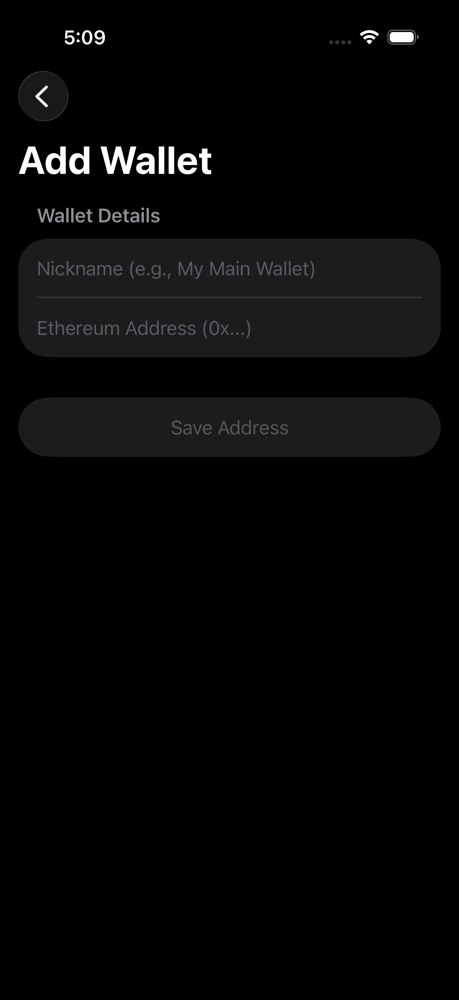

# Ether.fi Portfolio Tracker

A native iOS application for tracking Ether.fi portfolio balances, built with modern Swift and SwiftUI architecture. This app allows users to add multiple Ethereum wallets and view their holdings of ETH, eETH, and weETH.

## 📸 Screenshots

|                  My Wallets (List)                  |                    Add Wallet                    |                   Portfolio Detail                    |
|:---------------------------------------------------:|:------------------------------------------------:|:-----------------------------------------------------:|
|  |  |  |

|                Stake UI                |               Wrap UI                |                  Demo Card                   |
|:--------------------------------------:|:------------------------------------:|:--------------------------------------------:|
|  |  |  |

## ✨ Features

* **Multi-Wallet Tracking:** Add and save multiple Ethereum wallets with custom nicknames.
* **Portfolio Dashboard:** View a detailed breakdown of token balances (ETH, eETH, weETH) and their live USD value.
* **Parallel Data Fetching:** Fetches all token balances and prices concurrently for a fast, responsive user experience.
* **Simulated Actions:**
    * **Staking Interface:** A UI simulating the staking of ETH for eETH.
    * **Wrapping Interface:** A UI simulating the wrapping of eETH for weETH.

## 🏛️ Architecture & Tech Stack

This project is built using a modern, scalable, and testable architecture. It follows Apple's recommended **MVVM (Model-View-ViewModel)** pattern with a separation of concerns.

* **UI (View):** Built entirely with **SwiftUI** for a declarative, state-driven UI.
* **State Management (ViewModel):** Uses the **@Observable** macro to expose UI state and handle business logic with automatic view updates.
* **Asynchronous:** Leverages **Swift Concurrency** (`async`/`await`) with structured concurrency for all background tasks and network calls.
* **Dependency Injection:** Uses **protocol-based dependency injection** to manage dependencies and simplify testing.
* **Networking:** Uses **URLSession** with async/await for type-safe network requests to the Etherscan and CoinGecko APIs.
* **JSON Parsing:** Uses **Codable** for efficient JSON parsing with Swift's native type system.
* **Navigation:** Uses **NavigationStack** to manage app flow, including a tabbed interface for the main wallet view.
* **Data Persistence:** Uses **SwiftData** (Swift's modern persistence framework) to save and retrieve user-added wallets.

### Project Structure

```
├── Core/
│   ├── Components/        # Reusable UI components (Token Icons)
│   ├── Data/Models/       # Data models (WalletAddress)
│   ├── Networking/        # API services and network models
│   ├── Theme/            # App colors and styling
│   └── Utils/            # Helper functions (Formatters)
├── Features/
│   ├── AddWallet/        # Add wallet functionality
│   ├── Card/             # Demo card view
│   ├── Portfolio/        # Portfolio dashboard
│   ├── Shared/           # Shared components (SwapComponents)
│   ├── StakeWrap/        # Container for Stake/Wrap tabs
│   ├── Staking/          # Staking interface
│   ├── Vault/            # Vault view (placeholder)
│   ├── WalletList/       # List of saved wallets
│   ├── WalletMain/       # Main wallet view with tabs
│   └── Wrap/             # Wrapping interface
└── EtherFiTracker/       # App entry point and assets
```

## 🚀 How to Build

### Prerequisites

* **Xcode 15.0** or higher
* **iOS 17.0** or higher (for SwiftData support)
* macOS Ventura or higher

### Building

1.  **Clone the repository:**
    ```bash
    git clone https://github.com/kaseLunt/etherfi_sample_ios.git
    ```

2.  **Get API Keys:**
    This project requires an API key from **Etherscan** to fetch wallet balances.
    * Visit [etherscan.io](https://etherscan.io/myapikey) and create a free API key.

3.  **Add API Key:**
    * Open the `Info.plist` file in the `EtherFiTracker` folder.
    * Replace the value for `ETHERSCAN_API_KEY` with your API key:
        ```xml
        <key>ETHERSCAN_API_KEY</key>
        <string>YOUR_API_KEY_HERE</string>
        ```
    * Or use the provided demo key:
        ```xml
        <key>ETHERSCAN_API_KEY</key>
        <string>D4I6VKNUIAGDDHCAUWTY9AVCVD3ZWGFITI</string>
        ```

4.  **Build and Run:**
    * Open `EtherFiTracker.xcodeproj` in Xcode.
    * Select a target device or simulator (iOS 17.0+).
    * Press `⌘R` to build and run the app.

## 🎨 Key Features Explained

### Custom Token Icons
The app features fully custom-drawn token icons for ETH, eETH, and weETH using SwiftUI's `Canvas` and `Path` APIs, matching the exact brand designs with gradients and geometric precision.

### Parallel Network Requests
The app uses Swift's structured concurrency with `async let` and `TaskGroup` to fetch multiple balances and prices simultaneously, ensuring optimal performance:

```swift
async let ethResponse = etherscanService.getEthBalance(for: address)
async let eethResponse = etherscanService.getTokenBalance(...)
async let prices = coinGeckoService.getPrices(...)

let (eth, eeth, priceData) = try await (ethResponse, eethResponse, prices)
```

### Protocol-Based Architecture
All services are defined as protocols, making the code testable and allowing for easy mock implementations:

```swift
protocol EtherscanServiceProtocol {
    func getEthBalance(for address: String) async throws -> EtherscanBalanceResponse
    func getTokenBalance(for address: String, contractAddress: String) async throws -> EtherscanBalanceResponse
}
```

### SwiftData Integration
Wallet addresses are persisted using SwiftData's `@Model` macro, providing automatic persistence with minimal boilerplate:

```swift
@Model
final class WalletAddress {
    var nickname: String
    var address: String
    
    init(nickname: String, address: String) {
        self.nickname = nickname
        self.address = address
    }
}
```

## 📈 Future Improvements

Future work would include:

* **Shared State Management:** Creating a shared `@Observable` class scoped to the `WalletMainView` to fetch all balances once, preventing redundant network calls across tabs.
* **Real Transactions:** Integrating with a library like `Web3.swift` or `WalletConnect` to sign and send real staking/wrapping transactions.
* **Error Handling:** Implementing a more sophisticated error handling system with toast notifications or alerts instead of inline error text.
* **Caching:** Adding a caching layer for API responses to reduce network calls and improve offline functionality.
* **Unit Tests:** Adding comprehensive unit tests for ViewModels and Services using Swift Testing or XCTest.
* **UI Tests:** Implementing UI tests to ensure critical user flows work correctly.

## 📝 Notes

* This is a **demo application** created to showcase Swift/SwiftUI development skills.
* The staking and wrapping interfaces are **simulated** and do not perform real blockchain transactions.
* The app uses real APIs (Etherscan and CoinGecko) to fetch actual balance and price data.

## 📄 License

This project is for demonstration purposes.

---
